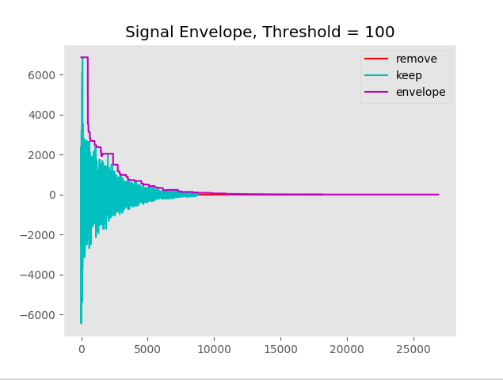
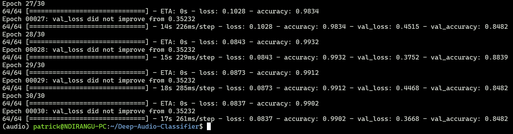
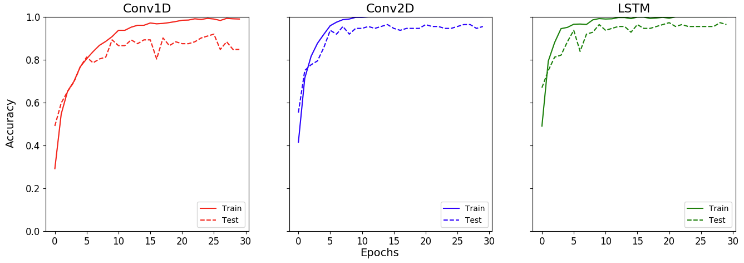
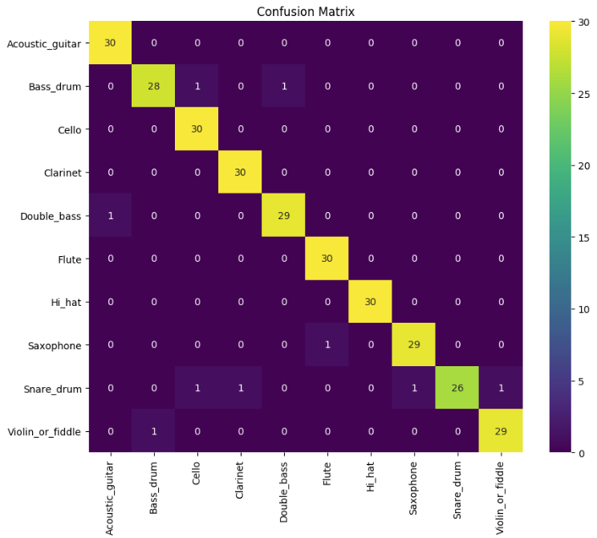
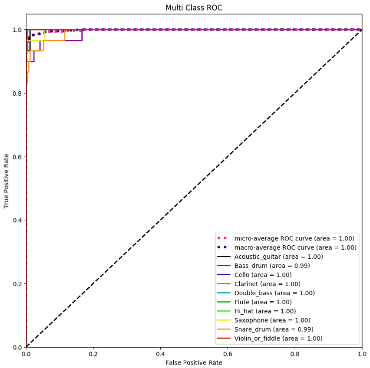
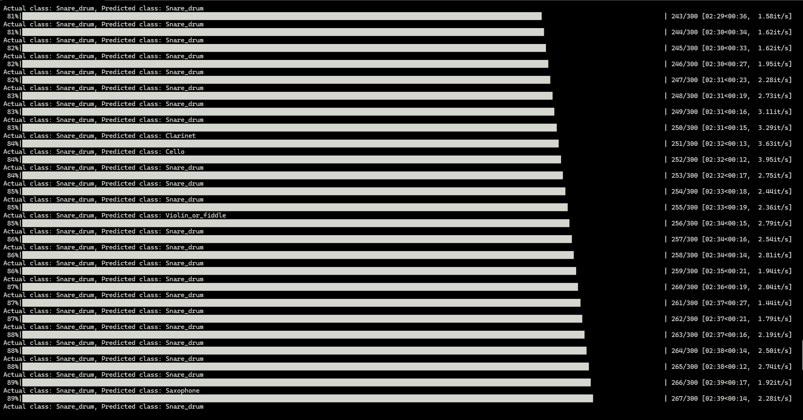

# Audio-Classification
This Deep Learning model is for classifying audio using Tensorflow and Kapre (Keras Audio Preprocessors)

## Environment setup
The development environment can be setup as follows:
```
conda create --name audio python==3.7
conda activate audio
git clone git@github.com:Patricknmaina/Deep-Audio-Classifier.git
cd Deep-Audio-Classifier/
pip install -r requirements.txt
```
To access the jupyter environment, run the following command:
```
jupyter-notebook
```

## Audio Preprocessing
audio_clean.py is used to downsample the audio and remove dead cells in the audio with threshold detection using a signal envelope.

The file is run using the following command:

`python audio_clean.py`

In order to downsample the audio wavfiles by delta time, uncomment the `split_wavs` function. This will create a clean directory with the downsampled mono audio wavfiles.



## Model Training
In the train.py file, change the model_type to either conv1d, conv2d or lstm in the main function.

The delta time and sample rate should be constant from audio_clean.py

Then run the code as follows:

`python train.py`

The training process looks as follows:



## Model Plots
After training the 3 models, the training logs are saved and implemented in `notebooks/Model Plots.ipynb`



The confusion matrix is developed in `notebooks/Confusion Matrix and ROC.ipynb`



The Receiver Operating Characteristic (ROC) curve is also developed in `notebooks/Confusion Matrix and ROC.ipynb`



## Model prediction
In predict.py, change the model_type to either conv1d, conv2d or lstm in the main function to evaluate the performance of the trained models with test datasets.

Run the following code:

`python predict.py`

The prediction process is shown below:



## References
Kapre -> for computation of audio transforms from time to frequency domain
- [Github link](https://github.com/keunwoochoi/kapre)
- [Kapre research paper](https://arxiv.org/pdf/1706.05781)
